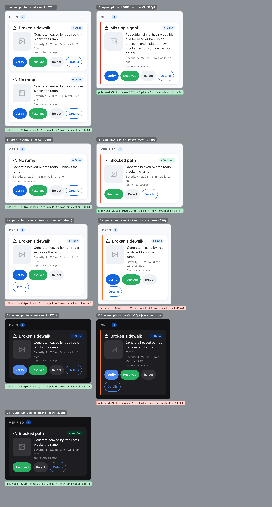
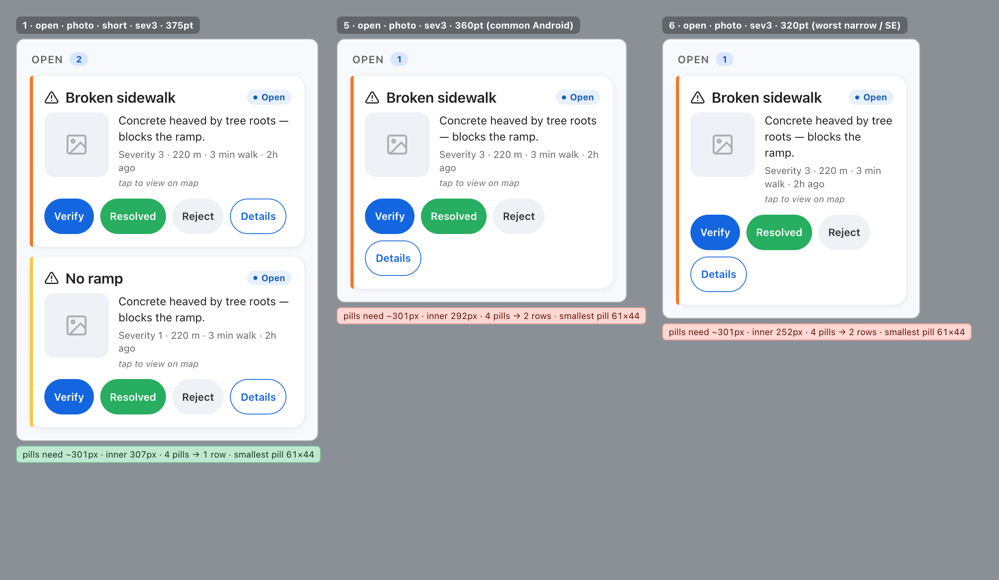
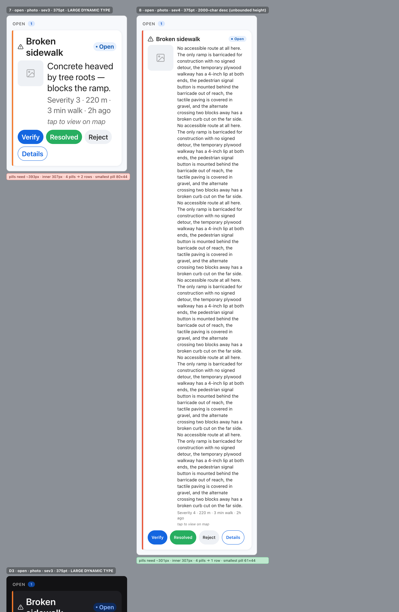

# FlagCard Redesign — PROMPT 1: DISCOVERY (read-only)

**Date:** 2026-06-26 · **Component:** the Tasks-list barrier card ("FlagCard") · **Pass:** 1 of N (DISCOVERY only — no redesign, no proposals, no code changes) · **Repo:** `~/AccessMap` (HEAD `8a7cce5`, `main`)

> **What this is:** the first focused pass of the FlagCard redesign recipe. It renders the current card, names its job, measures *why* it's cluttered (in numbers), maps the full overlap/wrap breakage envelope, says what's essential to keep, and hands the next ("direction") pass a sharp brief. It diagnoses; it does **not** propose or build. Strictly read-only on app code.
>
> **The lens** (Sky's taste): *expensive = material depth (glass/light/depth) used with restraint + breathing room, anchored by editorial type + whitespace, always legible. Rich in material, minimal in quantity. The enemy = cluttered / overlapping / busy.* And **two independent gates**, both of which must be *proven*: **GATE 1 — CLEAN** (decluttered, clear hierarchy, air) and **GATE 2 — ACCESSIBLE** (vision · touch · screen-reader).

---

## ★ Two things to know before anything else

**1. There are TWO components named `FlagCard`. The cluttered one is NOT the obvious file.**
- `src/components/FlagCard.tsx` — a *simple read-only row* (category, severity dot, status, description, thumb) with **only `onPress`, no action buttons**. Used by the MyReports / ActivityFeed / MyWatched modals. **Not the one Sky means** (it has no buttons to overlap).
- **The redesign target** is a **second, private `FlagCard` defined *inside* `src/screens/TasksScreen.tsx`** — component at **L1294–1530**, props at L1272–1287, styles at L1718–1785. `TasksScreen` shadows the import with its own local `const FlagCard = memo(…)`. Its action-row layout is **not** covered by the `__tests__/FlagCard.test.tsx` tests (those test the shared component).

**2. The "overlap" is really *ragged wrapping + crowding*, not literal paint-overlap.** `cardActions` uses `flexWrap:'wrap'`, so when the pills don't fit they drop to a second ragged line rather than painting on top of each other. The perceived clutter is real; the precise mechanism (proven by the render below) is **content-sized pills with no flex distribution and near-zero width headroom**. Naming it correctly is what makes the fix definitive.

---

## 1. The current card — "before" + baseline feel

**Where it lives:** `src/screens/TasksScreen.tsx:1294–1530` (render) + `:1718–1785` (styles), inside the Tasks tab's `SectionList` (sections "Open" then "Verified"; `renderItem` at L688–713).

**Before screenshots** — faithful 1:1 reconstructions from the real component styles + theme tokens (method + fidelity notes in the Coverage section). The green/red chip under each card is a **live measurement from the render** (pixels the pill row *needs* vs the card's inner width, and how many rows the pills actually occupy).

**Standard states + wrap onset (light + dark):**

**The overlap progression — 375pt (just fits) → 360pt (wraps) → 320pt (wraps worse):**

**The Gate-2 extremes — large Dynamic Type wraps on every width; a long description grows the card unbounded:**

### ★ Baseline emotional read (the honest "before" feeling)
First second, before reading a word: **a busy white slab shouting four candy-colored buttons.** The eye has nowhere to land — a blue pill, a green pill, a gray pill and an outlined pill all compete at equal size, a photo tugs one way and an 18pt title another, and a faint italic *"tap to view on map"* nags underneath. It reads like a **dense admin/CRUD form row or a control panel**, not a calm product card — *functional but cluttered, utilitarian, cheap-feeling.* On a narrow phone or at larger text the fourth button drops to its own line, so it also looks slightly **broken/unfinished**. The dominant emotion is **clutter and low confidence** — the precise opposite of the restrained, expensive, editorial feeling Sky wants. Goal for the recipe: move from *busy / shouting / lopsided* → *calm / clear / expensive.*

---

## 2. The card's job (the decluttering lens)

In the Tasks **triage queue**, for each community-reported barrier the user is deciding:

> **"Is this report real and worth acting on — do I Verify it, mark it Resolved, Reject it, or open Details to look closer?"**

Every element earns its place only if it serves that triage decision. That is the lens for *essential vs noise* below.

---

## 3. Element inventory — ESSENTIAL / SUPPORTING / NOISE

**Content** (`TasksScreen.tsx:1339–1465`):

| Element | What it is | Code | Verdict (vs the job) |
|---|---|---|---|
| Category icon + **title** | the barrier type, e.g. "Broken sidewalk" (`CATEGORY_LABELS`; longest is 15 chars) | L1369–1370 | **ESSENTIAL** — what it is |
| **Severity** | 4px colored left stripe + "Severity N" buried in the meta line (1–5 → Minor…Severe) | L1362, L1453 | **ESSENTIAL** — how bad (✓ not color-alone) |
| **StatusBadge** (sm) | tinted pill; in Tasks only "Open" or "Verified" ever show | L1371 | **ESSENTIAL** — tells you which actions apply |
| **Photo** thumbnail | 80×80 lazy image, opens a lightbox | L1387–1449 | **ESSENTIAL when present** — evidence to judge verify/reject |
| **Meta** line | "Severity N · 220 m · 3 min walk · 2h ago" | L1452–1456 | **SUPPORTING** — prioritization |
| **Description** | reporter's free text — **no `numberOfLines` clamp → unbounded height** (cap 2000 chars) | L1451, `cardDesc` L1759 | **SUPPORTING** — should be truncatable/secondary |
| **Hint** line | italic *"tap to view on map"* | L1457–1463 | **NOISE candidate** — redundant with the card's obvious tappability + its a11y hint |
| Selection checkmark | 22×22, only in bulk-select mode | L1376–1384 | ESSENTIAL *in that mode only* |

**Controls** — action row `cardActions` (`TasksScreen.tsx:1470–1516`); **4 buttons when `status==='open'`, 3 when `'verified'`**:

| Button | Action | Code | Verdict |
|---|---|---|---|
| **Verify** (open only) | `onSetStatus(id,'verified')` | L1473 | **ESSENTIAL** |
| **Resolved** | `onSetStatus(id,'resolved')` | L1484 | **ESSENTIAL** |
| **Reject** | `onSetStatus(id,'rejected')` (confirms first) | L1494 | **ESSENTIAL** |
| **Details** | `onShowDetails(flag)` → FlagDetailModal | L1504 | **ESSENTIAL** — but visually it's the 4th pill that breaks the row |

*Not on this card:* no place-name (there is no place field — only `lat/lng` → a distance string), no points/score (points only flash transiently in the parent; code awards 10/3/15/7 — `src/lib/points.ts:11`), no tags. So the title is always a short fixed label; **the only unbounded text is the description.**

---

## 4. The measured diagnosis — Gate 1 and Gate 2 (kept separate)

### GATE 1 — CLEAN (clutter, quantified)
- **Element count: ~8–10 distinct rendered elements** in the common open+photo state (stripe, icon, title, status badge, thumbnail, description, meta, hint, + 4 action pills). For contrast, the Home screen's reference list row renders **4** (dot, title, one meta line, chevron).
- **Competing visual weights: ~3 zones fighting** — the title block, the 80×80 photo, and an **action bank of four equally-weighted pills**. Three are saturated fills (brand blue / success green / neutral gray) plus one outlined — same size, same shape, **nothing designated primary.** The action bank carries as much visual weight as the actual content.
- **Hierarchy:** weak. The italic hint adds a fourth text line of near-zero value beneath description + meta.
- **Spacing / elevation vs Home:** the card is **over-elevated** — it uses `shadow.e2` ("Floating", `card` L1725) whereas `DESIGN.md §5`'s own elevation rule says in-flow list rows should read **Flat** (Home's `listCard` has *no shadow*; its rows are split by a hairline). Severity is shown as a **bare number in 12pt muted meta text** rather than a legible badge, even though a `SeverityBadge` (number always shown) exists in the system.

### GATE 2 — ACCESSIBLE (vision · touch · screen-reader — independent, with px)
- **VISION:** severity and status are **not** conveyed by color alone (stripe + "Severity N" text; badge = dot **+** label) ✓. From the tokens, text contrast on the white/dark surface is AA. **Dynamic Type risk:** the description is `AppText variant="body"`, which is **uncapped** — at large text it grows without limit (measured: a long description drives the card to **1612px tall**, see §5). Button/title labels are `variant="label"`, capped at ~1.6×.
- **TOUCH (measured):** every pill meets the height floor (`minHeight:44`); the **smallest rendered pill is 61×44** — so, contrary to a pre-render hypothesis, the pills are **not** under-width (the 24px horizontal padding keeps them ≥61px). **The real touch risk is mis-tap, not size:** four adjacent, identically-styled pills with **no `hitSlop`** (`actionBtn` L1763–1773), sitting on a **ragged wrapped row** at ≤360pt and at large type — destructive actions (Reject) packed against constructive ones (Verify/Resolved) with only an 8px gap.
- **SCREEN-READER (code):** the card `Pressable` has role + state + label + hint ✓; all four buttons have real text labels (no icon-only mystery buttons) ✓; the decorative stripe + checkmark are correctly a11y-hidden ✓. **Minor:** Verify / Resolved / Reject have no `accessibilityHint` (only Details does). **Real VoiceOver/TalkBack pass = NEEDS-SKY-DEVICE.**

---

## 5. ★ The overlap dossier — root cause + full breakage envelope

### Root cause (confirmed firsthand in code)
- **`cardActions`** (`TasksScreen.tsx:1762`): `{ flexDirection:'row', flexWrap:'wrap', gap:8, marginTop:4 }`.
- **`actionBtn`** (L1763–1773): `paddingHorizontal:12, paddingVertical:8, borderRadius:999, minHeight:44` — **no `width`, no `minWidth`, no `maxWidth`, no `flex`/`flexBasis`/`flexShrink`.** The pills are **content-sized** and **cannot share or compress** row space — the row can only **wrap**. The code comment at L1766 even encodes the false assumption: *"md horizontal padding keeps all four actions on one row."*
- The **correct pattern already exists in the same file**: the bulk-action bar's `bulkBtn` uses `flexGrow:1, flexBasis:0` to share the row evenly and never wrap. The per-card pills were simply never given equal-share flex, a width floor, or a smaller count.

### Measured breakage envelope (live values from the render)
Pill intrinsic widths (rendered): **Verify 61 · Resolved 82 · Reject 64 · Details 70** px, + 3×8px gaps = **301px needed** for 4 pills (**232px** for the 3-pill verified state).

| State | Device width | Card inner width | Pills | Row needs | **Result** | Card height |
|---|---:|---:|:--:|---:|:--|---:|
| open · photo · short · sev3 | **375pt** | 307px | 4 | 301px | **1 row — fits with only 6px to spare** | 212px |
| open · photo · long desc · sev5 | 375 | 307 | 4 | 301 | 1 row | 272 |
| open · **no photo** · sev2 | 375 | 307 | 4 | 301 | 1 row | 196 |
| **verified** (3 pills) · sev4 | 375 | 307 | 3 | 232 | 1 row | 212 |
| open · photo · sev3 | **360pt** | 292 | 4 | 301 | **2 rows — WRAPS** (9px short) | 264 |
| open · photo · sev3 | **320pt** | 252 | 4 | 301 | **2 rows — WRAPS** (49px short) | 284 |
| open · **large Dynamic Type** | 375 | 307 | 4 | **393** | **2 rows — WRAPS** (86px short); pills grow to 80/112/85/92 | 421 |
| open · **2000-char description** | 375 | 307 | 4 | 301 | 1 row, but **card = 1612px tall** | **1612** |

### The honest headline
The action row has **essentially zero resilience.** At the single best case — a stock 375pt iPhone at default text size — the four pills *just barely* fit on one line with **6px of headroom**, which already reads as cramped (four saturated pills jammed edge-to-edge). The moment anything narrows the effective width — **a 360pt-class Android, an iPhone mini/SE, or Display Zoom on any iPhone** — or the user **bumps up text size**, the row **wraps into a lopsided 2-row stack** (the stranded pill is what Sky perceives as "overlapping"). And a long description grows the card without bound. **The redesign must not rely on four content-sized pills fitting a fixed row — that bet barely wins once and loses everywhere else.**

---

## 6. What's essential to keep (declutter without losing function)

Grounded in the triage job, these must survive any redesign:
- **Category title + icon** (what the barrier is).
- **Severity** — but shown *legibly* (a badge/number a glance can read), not a bare number inside muted meta text.
- **Status** (Open / Verified) — it gates which actions apply.
- **Photo evidence** when present.
- **The four actions** — Verify (open only) / Resolved / Reject / Details. (Whether all four stay equally prominent is the *next* pass's call; that they remain reachable is non-negotiable.)
- **Distance + time** as *quiet* support.

Clearest declutter candidates (for the direction pass to decide, not proposed here): the italic **"tap to view on map" hint**, the **heavy elevation**, the **four-equal-pills** treatment, and the **buried severity number**. The **description** can be truncated/secondary.

---

## 7. Reference notes — the language the redesign extends

**Home's feel** (`src/screens/HomeScreen.tsx`): a muted screen wash with **Flat**, bright `listCard`s (hairline border, **no shadow**, rows split by an inset hairline), a 40pt display title via `ScreenHeader`, and *one* restrained `GlassSurface` accent. Rows are 4 elements + one meta line. "Expensive" here = grouping + type hierarchy + whitespace, **not** stacked elevated boxes.

**Reusable primitives** (`src/components/ui/`):
- `GlassSurface` — expo-blur + an AA contrast-floor tint; props `intensity` / `tint` / `borderRadius`.
- `PressableScale` — 0.97 spring press, reduced-motion-gated; caller supplies a11y + hitSlop.
- `Card` — role-based elevation (Flat/e1/e2/e3) + a brand focus ring.
- `AppText` — variants display / heading / body / label / mono, each with its own Dynamic-Type cap.
- `ScreenHeader` — eyebrow → 40pt title → subtitle.
- `Button` — all sizes enforce the 44pt min target.
- `StatusBadge`, and **`SeverityBadge`** (renders the number always — the Tasks card currently does *not* use this and could).

**Tokens** (`src/theme.ts` + `src/theme/ThemeContext.tsx`, via `useColor()`): full light/dark semantic colors; severity ramp **1 `#F7C948` Minor → 5 `#D92D20` Severe**; spacing 4-grid (sm 8 / md 12 / lg 16 / xl 20 / xxl 24); radius (md 12 / lg 16 / full 999); font sizes (caption 11 … xl 18 … display 48); `shadow.e1/e2/e3`; and the **4-tier elevation rule** (Flat list rows · e1 Lifted · e2 Floating · e3 Prominent).

---

## 8. ★ The design brief for the next (direction) pass

> **KEEP** the triage essentials — category title + icon, a *legible* severity, status, photo evidence, the four actions, and quiet distance/time.
>
> **KILL the clutter** at: the four equal-weight pills (no designated primary), the over-elevated `shadow.e2` (an in-flow list row should read **Flat** like Home's list), the **bare buried "Severity N"**, and the redundant italic **"tap to view on map"** hint.
>
> **FIX the overlap** — caused by **content-sized, non-flex pills** in a wrapping row (`cardActions` / `actionBtn`) with **only 6px of headroom at best and a deficit everywhere else.** Give the actions a deliberate layout that *cannot* wrap raggedly (equal-share flex with width floors, a reduced/primary-plus-overflow button set, or a different action surface), and **prove it down to 320pt and at the largest Dynamic Type**, in both themes.
>
> **SATISFY both gates — targets to beat:**
> - **Gate 1:** cut from ~3 competing zones / 8–10 elements toward Home's restraint; establish one clear primary; give the card breathing room and a Flat elevation.
> - **Gate 2:** every touch target ≥44×44 *with comfortable spacing and `hitSlop`* so adjacent constructive/destructive actions can't mis-tap; severity & status never color-alone; **no ragged wrap or unbounded growth at ×1.6+ Dynamic Type / long descriptions** (today: wraps at large type, 1612px tall on a long note); preserve SR labels/roles/states (and add the two missing button hints).
>
> **FEEL like** Sky's taste — material depth used with restraint, editorial type, generous whitespace, always legible — moving from today's **busy / shouting / lopsided** baseline toward **calm / clear / expensive.**

---

## 9. Coverage + device flags

**Read / confirmed firsthand (code):** the inline FlagCard component and *all* its styles (`TasksScreen.tsx:1272–1530, 1718–1785`); the flag data model + enums (`src/types/database.ts`, `src/lib/flags.ts`); the design tokens (`src/theme.ts`, `ThemeContext.tsx`); `StatusBadge.tsx`; the Home reference + `ui/` primitives. Severity = numeric 1–5; status in Tasks = open/verified only; points = 10/3/15/7.

**Rendered (measured):** a **pixel-faithful HTML reconstruction** of the card built 1:1 from the real styles/tokens, driven across the bounded stress matrix (open/verified × photo/no-photo × short/long/2000-char × 320/360/375pt × default/large Dynamic Type, both themes). Layout, type, spacing, color, elevation, and **wrap/overflow** render faithfully because RN-web compiles these same flexbox styles; **RN/Yoga fidelity was preserved by forcing `flex-shrink:0` on the pills** (RN's default; CSS defaults to 1) so the reconstruction wraps exactly like the device. Every overlap number above is a **live measurement read from the rendered DOM**, not an estimate.

**Fidelity caveat:** the brand fonts (Public Sans / Plus Jakarta Sans) fall back to the system sans in the reconstruction, so intrinsic pill widths can vary ~±10px vs a real device. The conclusions are robust to that — the best-case headroom is only 6px and the deficits at ≤360pt / large type are 9–86px.

**NEEDS-SKY-DEVICE (out of scope for this read-only pass):**
- Real iOS **blur/glass material + "feel"** (device-only; the web render shows layout/overlap faithfully but not native blur).
- Real **Safari/WebKit** layout (the web stack is Chromium-only-verified).
- Real **VoiceOver / TalkBack** reading order, and real **touch mis-tap** testing on the ragged wrapped row.
- An **authentic live-app capture** of the Tasks screen (the real screen is behind auth + needs seeded open/verified flags; per the agreed plan, the faithful reconstruction + the code math stand in for it here, and live capture was not pursued to keep this pass cheap and complete).

---

*Diagnosis only — no redesign, no proposals, no code touched. The direction pass starts from §8.*
